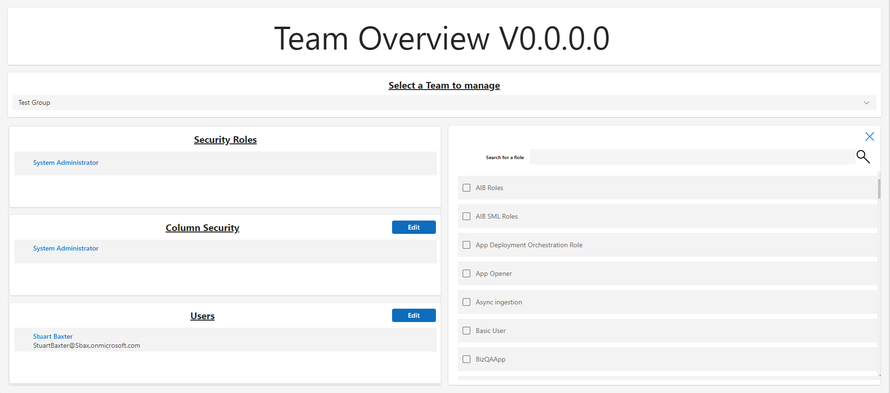

# Power Platform Teams Management

## Summary

This solution allows admins to manage assignment of Security Roles, Column Secuirty Profiles, and Users to Azure AD synced teams via a Canvas App.

I have also included a Power Automate Cloud Flow to create AAD synced team for demo purposes

## Authors

Solution|Author(s)
--------|---------
ManageSecurityRoles | Stuart Baxter - Business Applications MVP

## Version history

Version|Date|Comments
-------|----|--------
1.0.0.0|July 22, 2023|Initial release

## Features

This sample illustrates the following concepts:

* assigning of security roles to Power Platform Teams by using relate/unrelate
* assigning of column secuirty profiles to Power Platform Teams by using relate/unrelate
* assigning of users to Azure AD groups using the Azure Ad connector for Canvas Apps

## Prerequisites

* A Dataverse user account with access to System Admin Security Role
* Permissions to create Azure AD Groups

## Solution Components

The following solution components are used in this sample:

* Manage Power Platform Teams Canvas App (Canvas app)
* Add a new AAD group and associated Team (Cloud flow)
* AAD Group Admin (Environment variable)
* AAD Manage Security Roles (Connection reference)
* Dataverse Manage Security Roles (Connection reference)
* Manage Security Roles Component Library (Component library)

## Installation Instructions

* Download the **[Unmanaged](.Solutions/ManageSecurityRoles_1.0.0.0.zip)** or **[Managed](.Solutions/ManageSecurityRoles_1.0.0.0_managed.zip)** solution `.zip` from the `Solutions` folder
* Within **https://make.powerapps.com**, import the `.zip` file via **Solutions** > **Import solution** > **Browse** and select the `.zip` file you just downloaded.
* Click next.
* Click Import
* Run the **Add a new AAD group and associated Team** flow
* Open the **Manage Power Platform Teams Canvas App**

## Disclaimer

**THIS CODE IS PROVIDED *AS IS* WITHOUT WARRANTY OF ANY KIND, EITHER EXPRESS OR IMPLIED, INCLUDING ANY IMPLIED WARRANTIES OF FITNESS FOR A PARTICULAR PURPOSE, MERCHANTABILITY, OR NON-INFRINGEMENT.**

## For more information

- [Overview of creating apps in Power Apps](https://docs.microsoft.com/powerapps/maker/)
- [Power Apps canvas apps documentation](https://docs.microsoft.com/en-us/powerapps/maker/canvas-apps/)

